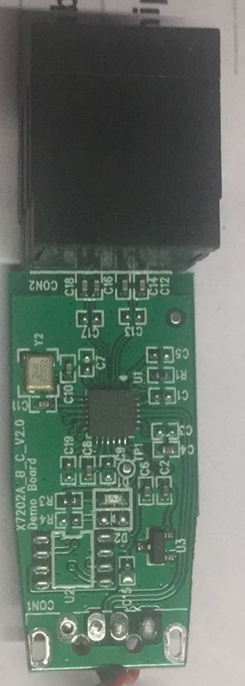
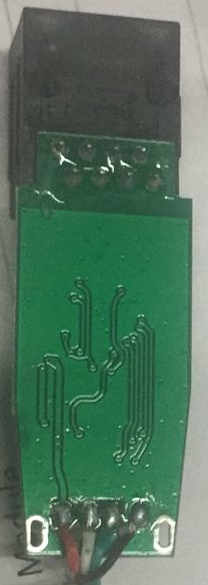
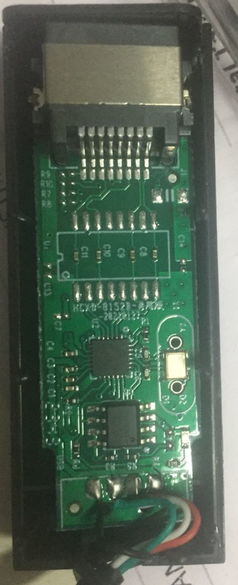
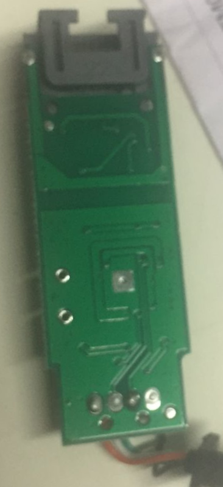
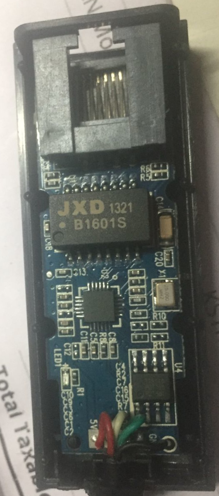
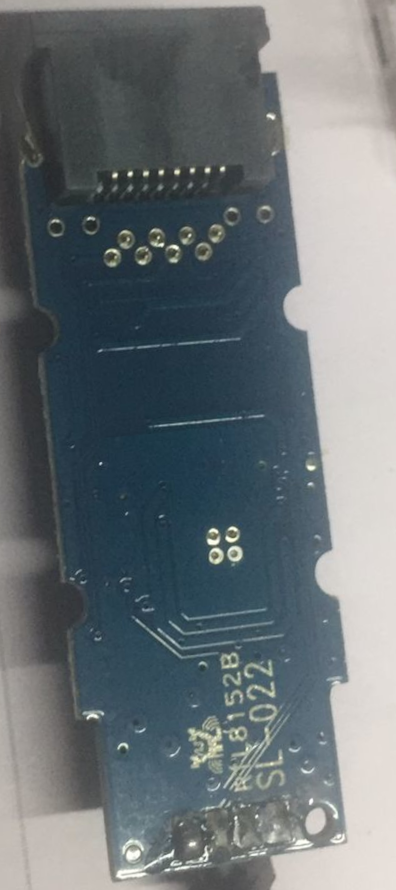

# USB_to_LAN
Testing USB-to-LAN adapters in Linux environments.


# Debian Test Lab

| Name | Image | PCB_Image | device IDs | Port | Price | Testing Environment |  Info  |
| --- |  --- | :---: | :---: | --- |  --- | :---: | :---: |
| [USB-to-LAN-BASIC](https://ltonlinestore.com/USB-to-LAN-Ethernet-Adapter-p96192804) | <p align="center"></p>| <p align="center"></p> | 35b5:3500 |  USB 2.0 | 180  | <table border="0"><tr><td><a href="https://www.speedtest.net/result/16867202571" target="_blank">speedtest</a></td></tr><tr><td>Debian GNU/Linux 11 (bullseye)</td></tr><tr><td>5.10.0-32-amd64</td><tr><p align="center"> PASS </tr></table>  | <table border="0"><tr><td>Type : USB Adapter</td></tr><tr><td>Bus Interface : Universal Serial Bus (USB2.0/1.1)</td></tr><tr><td>Transfer Rate : USB 1.1/2.0 data transfer rate - 12 / 480 Mbps and LAN data transfer rate - 10 / 100 Mbps</td></tr><tr><td>Half/Full duplex 10/100 Mbps operation</td></tr><tr><td>OS Support: Windows98/Me/2000/XP</td></tr></table> |
| [HAMMOK 2.0]() |  | <p align="center"></p> | 0bda:8152  |  USB 2.0 |  260  |  <table border="0"><tr><td><a href="https://www.speedtest.net/result/16871705547" target="_blank">speedtest</a></td></tr><tr><td>Debian GNU/Linux 11 (bullseye)</td></tr><tr><td>5.10.0-32-amd64</td><tr><p align="center"> PASS </tr></table>   |    |
| [HAMMOK 3.0]() |  |  |   |  TYPE-C  |  700  |  not_yet  |    |
| [LIVETECH 2.0]() |  | <p align="center"></p>   | 0bda:8152 |   USB 2.0 | 300   |  <table border="0"><tr><td><a href="https://www.speedtest.net/result/16871700753" target="_blank">speedtest</a></td></tr><tr><td>Debian GNU/Linux 11 (bullseye)</td></tr><tr><td>5.10.0-32-amd64</td><tr><p align="center"> PASS </tr></table>   |    |
| [COCONUT 2.0]() |  |   |   | USB 2.0 |  270  |  not_yet  |    |
| [COCONUT 3.0]() |  |   |   | USB 3.0 |  650  |  not_yet  |    |


# USB-to-LAN-BASIC

**To configure your USB to LAN adapter (enxec9a0c107e8c)**


```
$ ip
```

```
6: enxec9a0c107e8c: <NO-CARRIER,BROADCAST,MULTICAST,UP> mtu 1500 qdisc pfifo_fast state DOWN group default qlen 1000
    link/ether ec:9a:0c:10:7e:8c brd ff:ff:ff:ff:ff:ff
    inet 192.168.96.55/24 brd 192.168.96.255 scope global noprefixroute enxec9a0c107e8c
       valid_lft forever preferred_lft forever
    inet6 fe80::f561:ba40:e06d:53de/64 scope link tentative noprefixroute 
       valid_lft forever preferred_lft forever
```


```
$ sudo lshw -C network
```


```
       description: Ethernet interface
       physical id: 3
       bus info: usb@1:7
       logical name: enxec9a0c107e8c
       serial: ec:9a:0c:10:7e:8c
       capabilities: ethernet physical
       configuration: broadcast=yes driver=cdc_ether driverversion=5.10.0-32-amd64 firmware=CDC Ethernet Device link=no multicast=yes
```


**Using systemd and Network Configuration Files** 

**Create a New Service**

```
sudo nano /etc/systemd/system/usb-lan-auto-connect.service
```

[usb-lan-auto-connect.service](src/datasheet/nx7202c/usb-lan-auto-connect.service)


```
[Unit]
Description=Auto Connect USB to LAN Adapter
After=network.target

[Service]
Type=oneshot
ExecStart=/sbin/ip link set enxec9a0c107e8c up
ExecStart=/sbin/dhclient enxec9a0c107e8c
RemainAfterExit=yes

[Install]
WantedBy=multi-user.target
```

```
sudo systemctl enable usb-lan-auto-connect.service
sudo systemctl start usb-lan-auto-connect.service
```


# Notes:


# USB-to-LAN-BASIC

```
/sbin/modinfo usbnet
/sbin/modinfo cdc_ether
filename:       /lib/modules/5.10.0-32-amd64/kernel/drivers/net/usb/cdc_ether.ko

Oct 11 05:55:47 SH4D0W6 kernel: usb 1-7: Product: SZNX LAN 100M   
Oct 11 05:55:47 SH4D0W6 kernel: usb 1-7: Manufacturer: Naxiang   
Oct 11 05:55:47 SH4D0W6 kernel: usb 1-7: SerialNumber: EC9A0C107E8C
```

# LIVE_TECH 2.0


```

Bus 001 Device 006: ID 0bda:8152 Realtek Semiconductor Corp. RTL8152 Fast Ethernet Adapter


[  174.210918] usb 1-7: new high-speed USB device number 6 using xhci_hcd
[  174.359746] usb 1-7: New USB device found, idVendor=0bda, idProduct=8152, bcdDevice=20.00
[  174.359752] usb 1-7: New USB device strings: Mfr=1, Product=2, SerialNumber=3
[  174.359756] usb 1-7: Product: USB 10/100 LAN
[  174.359760] usb 1-7: Manufacturer: Realtek
[  174.359763] usb 1-7: SerialNumber: 00E04C360B55

```


# HAMMOK 2.0


```
Bus 001 Device 007: ID 0bda:8152 Realtek Semiconductor Corp. RTL8152 Fast Ethernet Adapter


[  380.360168] usb 1-7: new high-speed USB device number 7 using xhci_hcd
[  380.509101] usb 1-7: New USB device found, idVendor=0bda, idProduct=8152, bcdDevice=20.00
[  380.509104] usb 1-7: New USB device strings: Mfr=1, Product=2, SerialNumber=3
[  380.509106] usb 1-7: Product: USB 10/100 LAN
[  380.509107] usb 1-7: Manufacturer: Realtek
[  380.509108] usb 1-7: SerialNumber: 00E04C36032E
```


