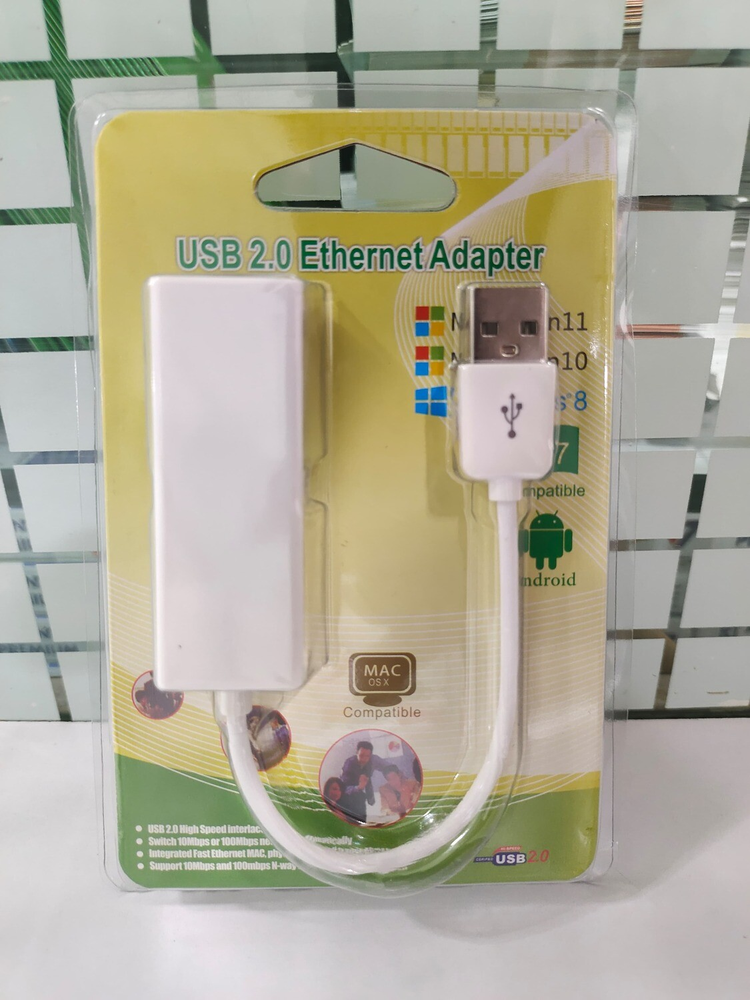
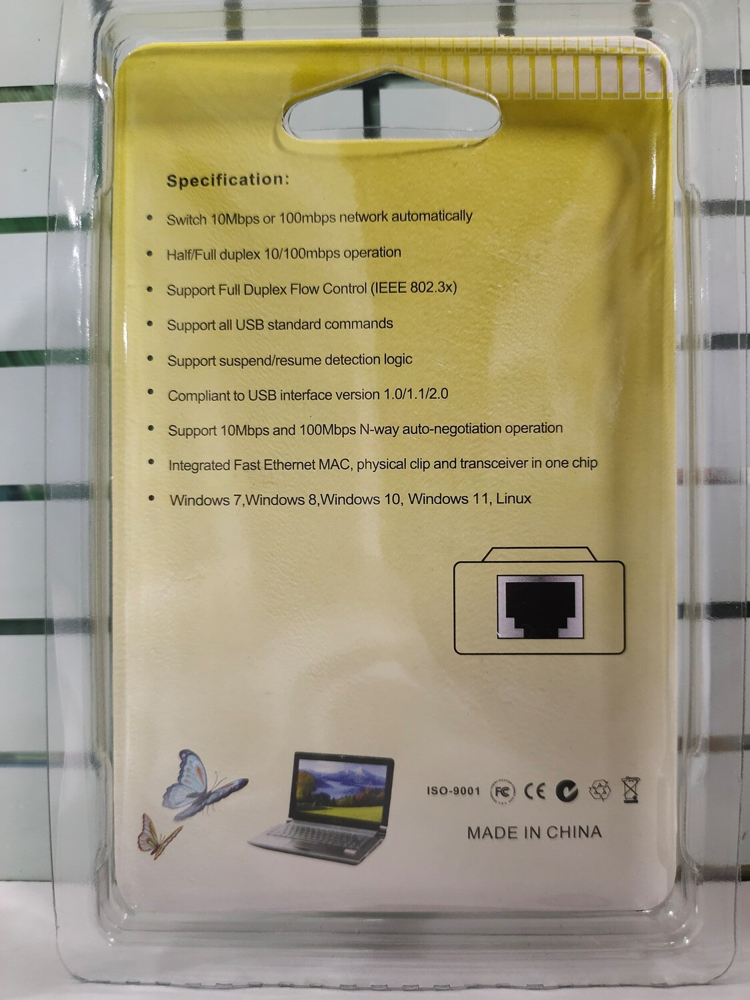

# USB_to_LAN
Testing USB-to-LAN adapters in Linux environments.

# Debian Test Lab

| Name | Image | PCB_Image | device IDs | Port | Price | Testing Environment |  Info  |
| --- |  --- | :---: | :---: | --- |  --- | :---: |    |
| [USB-to-LAN-Ethernet-Adapter](https://ltonlinestore.com/USB-to-LAN-Ethernet-Adapter-p96192804) | 

|   | ID 35b5:3500 |   |  |   |   | <table border="0"><tr><td>Type : USB Adapter</td></tr><tr><td>Bus Interface : Universal Serial Bus (USB2.0/1.1)</td></tr><tr><td>Transfer Rate : USB 1.1/2.0 data transfer rate - 12 / 480 Mbps and LAN data transfer rate - 10 / 100 Mbps</td></tr><tr><td>Half/Full duplex 10/100 Mbps operation</td></tr><tr><td>OS Support: Windows98/Me/2000/XP</td></tr></table> |
| [HAMMOK 2.0]() |  |   |   |  |    |  not_yet  |    |

